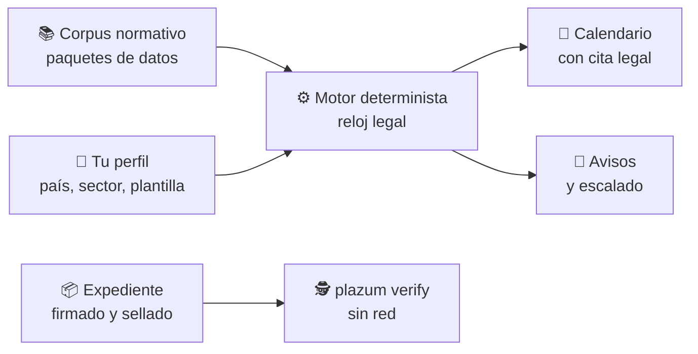

<div align="center">


[](https://github.com/marcosmatalab/plazum/actions/workflows/ci.yml)
[](https://github.com/marcosmatalab/plazum/releases/latest)
[](go.mod)
[](go.mod)
[](#-en-cifras)
[](LICENSE)
[](README.md)

**Qué normas te aplican, qué tienes que hacer y para qué fecha exacta, con el artículo en que se apoya cada plazo. Y un verificador de expedientes que funciona sin red y sin fiarse del emisor.**

[💡 Qué resuelve](#-qué-problema-resuelve) · [🚀 Probar](#-pruébalo-en-30-segundos) · [🔄 Cómo funciona](#-cómo-funciona) · [📊 Cifras](#-en-cifras) · [🧭 Decisiones](#-decisiones-de-diseño-y-su-coste)

</div>

## 💡 Qué problema resuelve

Una empresa europea mediana está sujeta a la vez a RGPD, NIS2, DORA, ENS, AI Act o CRA, y cada norma trae plazos: notificar un incidente en horas, contestar a un interesado en un mes, revisar una política cada año. Hoy viven en hojas de cálculo, y el que se pasa se paga en sanciones.

**plazum hace tres cosas:**

1. 🧮 **Calcula** qué obligaciones te aplican según tu perfil y la fecha exacta de cada una, con las reglas de cómputo del Rgto. 1182/71 y la Ley 39/2015, y distingue el plazo que fija la norma del que propone plazum como buena práctica.
2. 🔔 **Planifica** los avisos y el escalado a cada responsable antes del vencimiento, y los envía por correo cuando se lo ordenas.
3. 🔐 **Verifica** expedientes: `plazum verify` recalcula una cadena de evidencias firmada y sellada en el tiempo (RFC 3161) sin red y sin fiarse de quien la emite.

> **Ejemplo.** Un incidente expone datos personales. plazum marca las **72 horas** del art. 33.1 del RGPD para notificar a la autoridad de control. Si eres una entidad financiera y el incidente es grave, añade la notificación inicial de DORA: **4 horas** desde que lo clasificas, cruzadas con un tope de **24 horas** desde que lo conoces, como las combina el Reglamento Delegado 2025/301. Cada fecha lleva su artículo.


## 🚀 Pruébalo en 30 segundos

La imagen trae el binario, el corpus y un expediente de ejemplo. Sin Go y sin clonar:

```bash
docker run --rm ghcr.io/marcosmatalab/plazum:v0.1.1                 # una empresa de ejemplo y sus relojes
docker run --rm ghcr.io/marcosmatalab/plazum:v0.1.1 calendario --pais=ES --sector=servicios-digitales --empleados=200
docker run --rm ghcr.io/marcosmatalab/plazum:v0.1.1 verify expediente-demo.json contexto-demo.json
```

Con Go:

```bash
go install github.com/marcosmatalab/plazum/cmd/plazum@latest
plazum demo                 # la empresa de ejemplo y sus relojes
plazum demo --serve         # y el servidor web con ese estado
```


📥 Binarios para Linux, macOS y Windows en [la última release](https://github.com/marcosmatalab/plazum/releases/latest), con **SHA-256, SBOM y firma en Rekor**. Guía: [`docs/instalacion.md`](docs/instalacion.md).

## 🔄 Cómo funciona



| ⏱️ Reloj legal | 🔐 Expediente verificable | 📚 Normas como datos |
|---|---|---|
| Días hábiles y festivos combinables. Si la doctrina discrepa, calcula las dos lecturas. | Cadena de hashes, árbol Merkle (RFC 6962) y sello RFC 3161, recalculables sin red. | Una norma nueva es un paquete de datos, y CI se pone rojo si alguien cablea una en Go. |

## 🖥️ Pantallas

| 📌 Lo que vence hoy | 🧾 El acta: de dónde sale cada fecha |
|---|---|
|  |  |
| 🔔 **Plan de avisos con escalado** | 🔑 **Revisión de accesos sellada** |
|  |  |

La interfaz web está en castellano e inglés.

## 📊 En cifras

<!-- ingenieria:inicio -->
| 🧪 Casos de test | 📦 Líneas de Go de producción | 🔬 Líneas de Go de test | 🛡️ Suelo de cobertura del núcleo | ⚙️ Integración continua |
|:---:|:---:|:---:|:---:|:---:|
| **2.039** | **76.000** | **109.000** | **85 %** | **26 puertas** en **13 workflows** |

Líneas con comentarios. Con objetivos de fuzzing, detector de carreras y **24 de las 26 puertas en cada push a main y cada pull request**. *Casos, líneas, workflows y suelo los deriva del árbol `TestElParrafoDeIngenieriaPublicaLoQueDiceElArbol`, y CI se pone rojo si se separan.*
<!-- ingenieria:fin -->

📚 **El corpus:** **20 paquetes** con su estrato legal ([`paquetes/CORPUS.md`](paquetes/CORPUS.md)), los **20 con relojes reales: 285 hitos y 808 casos dorados** que se ejecutan contra el motor en cada `./comprobar.sh`.

## 🧠 La IA, fuera del cálculo por diseño

Las fechas tienen consecuencias jurídicas: ningún modelo entra en el cálculo. La IA tiene un solo canal, cuya única salida es una **propuesta con cita**, y una cita que no se verifica por hash contra la norma se descarta.

| Garantía | Se comprueba con |
|---|---|
| 🧮 El motor no depende de ningún modelo | test sobre el AST: `nucleo/` no importa nada de fuera |
| 🔁 El mismo dato da siempre la misma fecha | test sobre el AST que prohíbe `time.Now()` en `nucleo/` |
| 🔌 Todo funciona con la IA apagada | la suite entera con `PLAZUM_SIN_IA=1`, en CI |

El verificador de citas lo fijan **28 casos dorados sobre 8 fuentes** en `evals/citas/`. Doctrina en [`docs/ia.md`](docs/ia.md).

## 🧭 Decisiones de diseño y su coste

| Decisión | Por qué | Lo que cuesta |
|---|---|---|
| Cero dependencias | auditable sin red, sin superficie de suministro | PKCS#7 vendorizado con procedencia por SHA-256, y RFC 3161 escrito en casa |
| El instante es un dato | un expediente de hace meses se reverifica igual hoy | el instante cruza toda la API del núcleo |
| Normas como datos | añadir una norma no toca Go | un formato, un linter y sus casos dorados que mantener |
| Motor sin IA | resultados reproducibles y defendibles ante un auditor | la IA solo puede proponer, nunca calcular |
| OSCAL solo de salida | el modelo interno conserva los plazos | un export a OSCAL no puede llevarlos ([D-1](docs/decisiones.md)) |

🏛️ **Arquitectura hexagonal:** `nucleo/` (el motor, sin imports externos), `puertos/` (interfaces), `adaptadores/` (OIDC, SCIM, sellado, IA), `superficies/` (servidor web y pantallas), `cmd/plazum` (la CLI) y `paquetes/` (el corpus). Presupuestos con puerta en CI: binario ≤ 25 MB, arranque < 3 s, memoria < 256 MB.

## 📖 Documentación

| | |
|---|---|
| 📐 [`docs/invariantes.md`](docs/invariantes.md) | reglas de ingeniería, cada una con su test |
| 🛡️ [`docs/modelo-de-amenaza.md`](docs/modelo-de-amenaza.md) | qué prueba el expediente |
| 🗺️ [`docs/ETAPAS.md`](docs/ETAPAS.md) | hoja de ruta |
| 🛠️ [`docs/desarrollo.md`](docs/desarrollo.md#como-se-construyo) | cómo se construyó |

📌 Trabajo abierto y límites conocidos: [`docs/pendientes.md`](docs/pendientes.md).

## ⚖️ Licencia

Código **AGPL-3.0**. Datos propios del corpus **Apache-2.0**; los textos legales se reutilizan al amparo del art. 13 TRLPI y la Decisión 2011/833/UE, como declara cada paquete. Vulnerabilidades: [`SECURITY.md`](SECURITY.md). **Nada de esto es asesoramiento jurídico.**
