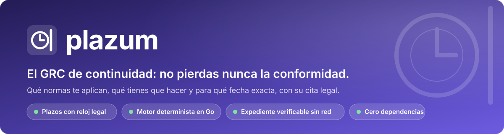
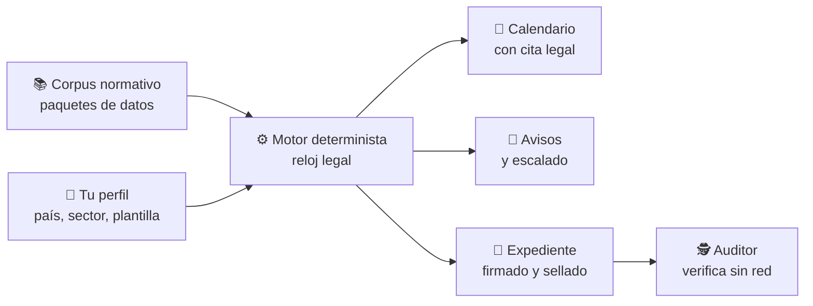

<div align="center">



[](https://github.com/marcosmatalab/plazum/actions/workflows/ci.yml)
[](https://github.com/marcosmatalab/plazum/releases/latest)
[](go.mod)
[](go.mod)
[](#-en-cifras)
[](LICENSE)
[](README.md)

**plazum te dice qué normas te aplican, qué tienes que hacer y para qué fecha exacta, con la cita legal de cada plazo. Y guarda la prueba de que lo hiciste en un expediente que un auditor verifica sin red.**

[🚀 Probar](#-pruébalo-en-30-segundos) · [🔄 Cómo funciona](#-cómo-funciona) · [📊 Cifras](#-en-cifras) · [🏛️ Arquitectura](#️-arquitectura) · [📖 Documentación](#-documentación)

</div>

## 🎯 En 45 segundos

| | |
|---|---|
| 🧭 **Qué es** | Un GRC open source de **continuidad de cumplimiento**: convierte la normativa europea y española (ENS, RGPD, NIS2, DORA, AI Act, CRA, eIDAS 2, ISO 27001...) en un calendario de obligaciones con fecha exacta. |
| 👥 **Para quién** | CISO y DPO que necesitan saber qué vence, cuándo y por qué artículo. |
| ⚙️ **Cómo** | Un motor determinista con **reloj legal** (días hábiles, festivos, cierres y traslados) sobre un corpus normativo escrito como **datos**, no como código. |
| 📦 **Qué entrega** | Calendario, avisos con escalado, revisión de accesos y un **expediente firmado** que un tercero recalcula sin fiarse del emisor. |


## 🚀 Pruébalo en 30 segundos

```bash
docker run --rm ghcr.io/marcosmatalab/plazum:v0.1.1   # sin Go, sin clonar
```

```bash
go install github.com/marcosmatalab/plazum/cmd/plazum@latest
plazum demo                 # una empresa de ejemplo y sus relojes
plazum demo --serve         # y el servidor web con ese estado
plazum calendario --pais=ES --sector=servicios-digitales --empleados=200
```


📥 Binarios para Linux, macOS y Windows en [la última release](https://github.com/marcosmatalab/plazum/releases/latest), con **SHA256, SBOM y firma en Rekor**. Guía completa: [`docs/instalacion.md`](docs/instalacion.md).

## 🔄 Cómo funciona



### Los tres pilares

| ⏱️ Reloj legal de verdad | 🔐 Expediente verificable offline | 📚 El corpus es datos |
|---|---|---|
| Días hábiles, festivos combinables, cierre y traslado según el Rgto. 1182/71 y la Ley 39/2015. Si la doctrina discrepa, calcula las dos lecturas. | Cadena de hashes, Merkle RFC 6962 y sellado RFC 3161: un tercero lo recalcula entero sin red. | Añadir una norma no toca Go, y el build se rompe si alguien cablea un identificador de norma. |

## 🖥️ Pantallas

| 📌 Lo que vence hoy | 🧾 El acta: de dónde sale cada fecha |
|---|---|
|  |  |
| 🔔 **Plan de avisos con escalado** | 🔑 **Revisión de accesos sellada** |
|  |  |

## 📊 En cifras

<!-- ingenieria:inicio -->
| 🧪 Casos de test | 📦 Líneas de producción | 🔬 Líneas de test | 🛡️ Suelo de cobertura del núcleo | ⚙️ Integración continua |
|:---:|:---:|:---:|:---:|:---:|
| **2.031** | **75.000** | **109.000** | **85 %** | **26 puertas** en **13 workflows** |

Con fuzzing y detector de carreras, y **24 de las 26 puertas en cada empujón y en cada pull request**. *Las deriva del árbol `TestElParrafoDeIngenieriaPublicaLoQueDiceElArbol`: si el código y esta tabla se separan, CI se pone rojo.*
<!-- ingenieria:fin -->

📚 **El corpus:** **20 paquetes** con su estrato legal ([`paquetes/CORPUS.md`](paquetes/CORPUS.md)), los **20 con relojes reales: 285 hitos y 808 casos dorados** que se ejecutan contra el motor en cada `./comprobar.sh`.

### ✅ Cada afirmación, con su comando

| Se afirma | Comando | Sale |
|---|---|---|
| Cero dependencias | `go list -deps -f '{{if not .Standard}}{{.ImportPath}}{{end}}' ./cmd/plazum \| grep -v '^github.com/marcosmatalab/plazum/'` | nada |
| Binario de 12,1 MB, con 25 de presupuesto | `GOOS=linux GOARCH=amd64 go build -ldflags="-s -w" -trimpath -o plazum ./cmd/plazum` | 12,1 MB en `linux/amd64` |
| La suite pasa sin red | `GOPROXY=off go test ./...` | `ok` |
| El núcleo no baja del 85 % | `go test ./nucleo/... -coverprofile=c.out && go tool cover -func=c.out` | sobre el suelo |
| Las puertas de CI, en tu máquina | `./comprobar.sh` | `26 puertas leidas` |

## 🧠 IA con frontera ejecutable

El motor emite fechas con consecuencias jurídicas: es determinista por contrato y ningún modelo entra en él.

| Garantía | Se comprueba con |
|---|---|
| 🧮 El motor no depende de un modelo | test sobre el AST: `nucleo/` no importa nada de fuera |
| 🔁 El cálculo es reproducible | test sobre el AST: el instante entra como dato, nunca del reloj |
| 🔌 Funciona con el modelo apagado | la suite entera con `PLAZUM_SIN_IA`, como puerta de CI |
| 🔗 Ninguna cita llega sin verificar | se resuelve por hash contra el texto de la norma, o se descarta |

La precisión del verificador de citas se publica: **28 casos dorados sobre 8 fuentes** en `evals/citas/`. Doctrina en [`docs/ia.md`](docs/ia.md).

## 🏛️ Arquitectura

Hexagonal, con las fronteras vigiladas por tests que leen el AST:

| Capa | Qué contiene |
|---|---|
| `nucleo/` | reloj legal, aplicabilidad, estado, ledger, expediente, corpus. **Cero imports externos** |
| `puertos/` | las interfaces hexagonales |
| `adaptadores/` | OIDC, SCIM, sellado RFC 3161, canales de aviso, IA |
| `superficies/` | servidor web, pantallas, calendario, revisión de accesos, SCIM, export a SIEM |
| `paquetes/` | el corpus normativo, como datos |
| `cmd/plazum` | la CLI: `demo`, `calendario`, `verify`, `explain`, `estado` |

### 🧭 Decisiones de diseño

| Decisión | Qué compra |
|---|---|
| Cero dependencias | auditoría sin red y superficie de suministro nula |
| El instante es un dato | un expediente de hace ocho meses se reverifica igual hoy |
| Corpus como datos | añadir una norma no toca Go |
| OSCAL solo de salida | el modelo interno conserva los plazos ([D-1](docs/decisiones.md)) |

### 📏 Presupuestos operativos, con puerta en CI

| Presupuesto | Techo |
|---|---|
| 📦 Binario | 25 MB |
| 🛡️ Cobertura del núcleo | ≥ 85 % |
| ⚡ Arranque en frío | < 3 s |
| 🧠 Memoria residente | < 256 MB |

## 📖 Documentación

| | |
|---|---|
| 📐 [`docs/invariantes.md`](docs/invariantes.md) | las reglas de ingeniería y el test que vigila cada una |
| 🏗️ [`docs/arquitectura.md`](docs/arquitectura.md) | la arquitectura en detalle |
| 🛡️ [`docs/modelo-de-amenaza.md`](docs/modelo-de-amenaza.md) | qué prueba el expediente |
| 🗺️ [`docs/ETAPAS.md`](docs/ETAPAS.md) | hoja de ruta: etapas 1 y 2 cerradas, la 3 en curso |
| 🛠️ [`docs/desarrollo.md`](docs/desarrollo.md#como-se-construyo) | cómo se construyó, y las puertas que pasa cada cambio |

📌 Trabajo abierto y límites conocidos: [`docs/pendientes.md`](docs/pendientes.md).

## ⚖️ Licencia

Código **AGPL-3.0**, SSO incluido. Corpus **Apache-2.0**. Vulnerabilidades: [`SECURITY.md`](SECURITY.md). **Nada de esto es asesoramiento jurídico.**
