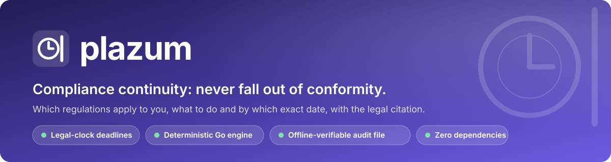
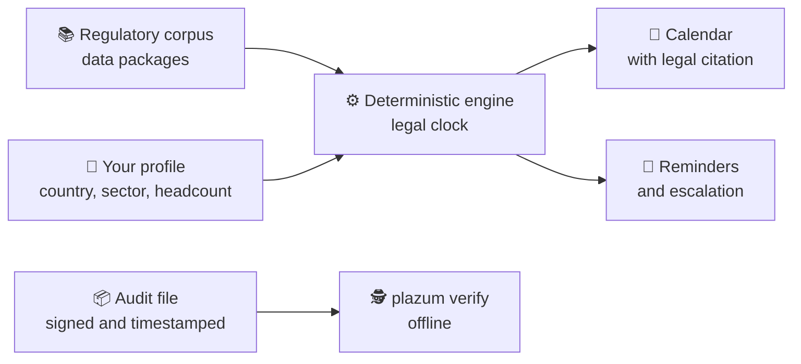
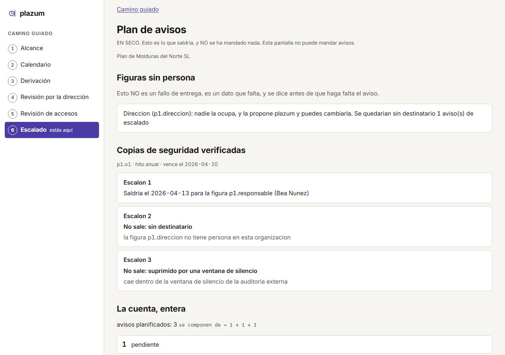
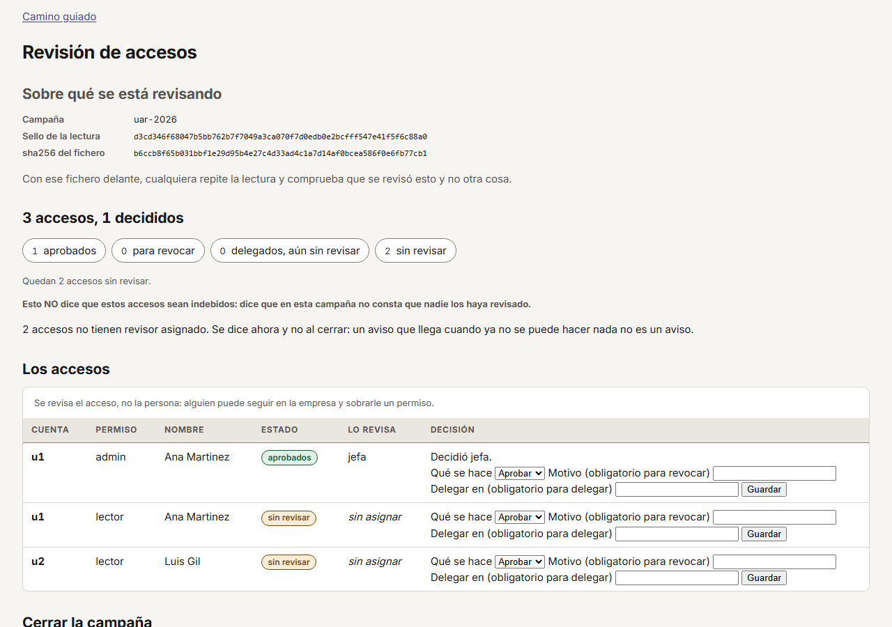

<div align="center">



[](https://github.com/marcosmatalab/plazum/actions/workflows/ci.yml)
[](https://github.com/marcosmatalab/plazum/releases/latest)
[](go.mod)
[](go.mod)
[](#-by-the-numbers)
[](LICENSE)
[](README.es.md)

**Which regulations apply to you, what you have to do and by which exact date, with the article behind every deadline. Plus an audit-file verifier that works offline and without trusting the issuer.**

[💡 The problem](#-the-problem-it-solves) · [🚀 Try it](#-try-it-in-30-seconds) · [🔄 How it works](#-how-it-works) · [📊 Numbers](#-by-the-numbers) · [🧭 Trade-offs](#-design-decisions-and-their-cost)

</div>

## 💡 The problem it solves

A mid-sized European company is bound at once by GDPR, NIS2, DORA, the AI Act, the CRA or Spain's ENS, and each one brings deadlines: report an incident within hours, answer a data subject within a month, review a policy every year. Today they live in spreadsheets, and a missed one ends in a fine.

**plazum does three things:**

1. 🧮 **Computes** which obligations apply to your profile and the exact due date of each, under the counting rules of Regulation 1182/71 and Spanish Law 39/2015, and tells a deadline set by law apart from one plazum proposes as good practice.
2. 🔔 **Plans** reminders and escalation to each owner ahead of the deadline, and emails them when you tell it to.
3. 🔐 **Verifies** audit files: `plazum verify` recomputes a signed, RFC 3161-timestamped chain of evidence offline, without trusting whoever issued it.

> **Example.** An incident exposes personal data. plazum sets the **72 hours** of GDPR Article 33(1) to notify the supervisory authority. If you are a financial entity and the incident is major, it adds DORA's initial notification: **4 hours** from classifying it, crossed with a **24-hour** cap from becoming aware, as Delegated Regulation 2025/301 combines them. Every date carries its article.


## 🚀 Try it in 30 seconds

The image ships the binary, the corpus and a sample audit file. No Go, no clone:

```bash
docker run --rm ghcr.io/marcosmatalab/plazum:v0.1.1                 # a sample company and its clocks
docker run --rm ghcr.io/marcosmatalab/plazum:v0.1.1 calendario --pais=ES --sector=servicios-digitales --empleados=200
docker run --rm ghcr.io/marcosmatalab/plazum:v0.1.1 verify expediente-demo.json contexto-demo.json
```

With Go:

```bash
go install github.com/marcosmatalab/plazum/cmd/plazum@latest
plazum demo                 # the sample company and its clocks
plazum demo --serve         # and the web server on that state
```


📥 Binaries for Linux, macOS and Windows in [the latest release](https://github.com/marcosmatalab/plazum/releases/latest), with **SHA-256, SBOM and a Rekor signature**. Guide: [`docs/instalacion.md`](docs/instalacion.md).

## 🔄 How it works



| ⏱️ Legal clock | 🔐 Verifiable audit file | 📚 Regulations as data |
|---|---|---|
| Working days and combinable holiday calendars. When doctrine disagrees, both readings are computed. | Hash chain, Merkle tree (RFC 6962) and RFC 3161 timestamps, recomputable offline. | A new regulation is a data package, and CI turns red if anyone hard-codes one in Go. |

## 🖥️ Screens

| 📌 What is due today | 🧾 The record: where every date comes from |
|---|---|
|  |  |
| 🔔 **Escalating reminder plan** | 🔑 **Sealed access review** |
|  |  |

The web interface ships in Spanish and English; the screenshots show the Spanish locale.

## 📊 By the numbers

<!-- ingenieria:inicio -->
| 🧪 Test cases | 📦 Lines of production Go | 🔬 Lines of test Go | 🛡️ Core coverage floor | ⚙️ Continuous integration |
|:---:|:---:|:---:|:---:|:---:|
| **2,039** | **76,000** | **109,000** | **85 %** | **26 gates** in **14 workflows** |

Line counts include comments. With fuzz targets, the race detector and **24 of the 26 gates on every push to main and every pull request**. *Cases, lines, workflows and the floor are derived from the tree by `TestElParrafoDeIngenieriaPublicaLoQueDiceElArbol`, and CI turns red if they drift.*
<!-- ingenieria:fin -->

📚 **The corpus:** **20 packages** with their legal stratum ([`paquetes/CORPUS.md`](paquetes/CORPUS.md)), all **20 with real clocks: 285 milestones and 808 golden cases** run against the engine on every `./comprobar.sh`.

## 🧠 AI kept out of the computation, by design

Dates carry legal consequences: no model takes part in the computation. AI has a single channel whose only output is a **proposal with a citation**, and a citation that does not verify by hash against the regulation is discarded.

| Guarantee | Enforced by |
|---|---|
| 🧮 The engine depends on no model | AST test: `nucleo/` imports nothing external |
| 🔁 Same input, same date, every time | AST test forbidding `time.Now()` in `nucleo/` |
| 🔌 Everything works with AI switched off | the whole suite runs with `PLAZUM_SIN_IA=1` in CI |

The citation verifier is pinned by **28 golden cases over 8 sources** in `evals/citas/`. Doctrine in [`docs/ia.md`](docs/ia.md).

## 🧭 Design decisions and their cost

| Decision | Why | What it costs |
|---|---|---|
| Zero dependencies | auditable offline, no supply-chain surface | PKCS#7 vendored with SHA-256 provenance, and RFC 3161 written in-house |
| Time is an input | an audit file from months ago reverifies identically today | time crosses the whole core API |
| Regulations as data | adding one touches no Go | a format, a linter and their golden cases to maintain |
| No AI in the engine | results that are reproducible and defensible to an auditor | AI can only propose, never compute |
| OSCAL as output only | the internal model keeps its deadlines | an OSCAL export cannot carry them ([D-1](docs/decisiones.md)) |

🏛️ **Hexagonal architecture:** `nucleo/` (the engine, no external imports), `puertos/` (interfaces), `adaptadores/` (OIDC, SCIM, timestamping, AI), `superficies/` (web server and screens), `cmd/plazum` (the CLI) and `paquetes/` (the corpus). Budgets gated in CI: binary ≤ 25 MB, cold start < 3 s, memory < 256 MB.

## 📖 Documentation

In-depth documentation is in Spanish, the language of the law it models.

| | |
|---|---|
| 📐 [`docs/invariantes.md`](docs/invariantes.md) | engineering rules, each with its test |
| 🛡️ [`docs/modelo-de-amenaza.md`](docs/modelo-de-amenaza.md) | what the audit file proves |
| 🗺️ [`docs/ETAPAS.md`](docs/ETAPAS.md) | roadmap |
| 🛠️ [`docs/desarrollo.md`](docs/desarrollo.md#como-se-construyo) | how it was built |

📌 Open work and known limitations: [`docs/pendientes.md`](docs/pendientes.md).

## ⚖️ Licence

Code **AGPL-3.0**. Our own corpus data **Apache-2.0**; the legal texts are reused under art. 13 of the Spanish Copyright Act (TRLPI) and Decision 2011/833/EU, as each package declares. Vulnerabilities: [`SECURITY.md`](SECURITY.md). **None of this is legal advice.**
