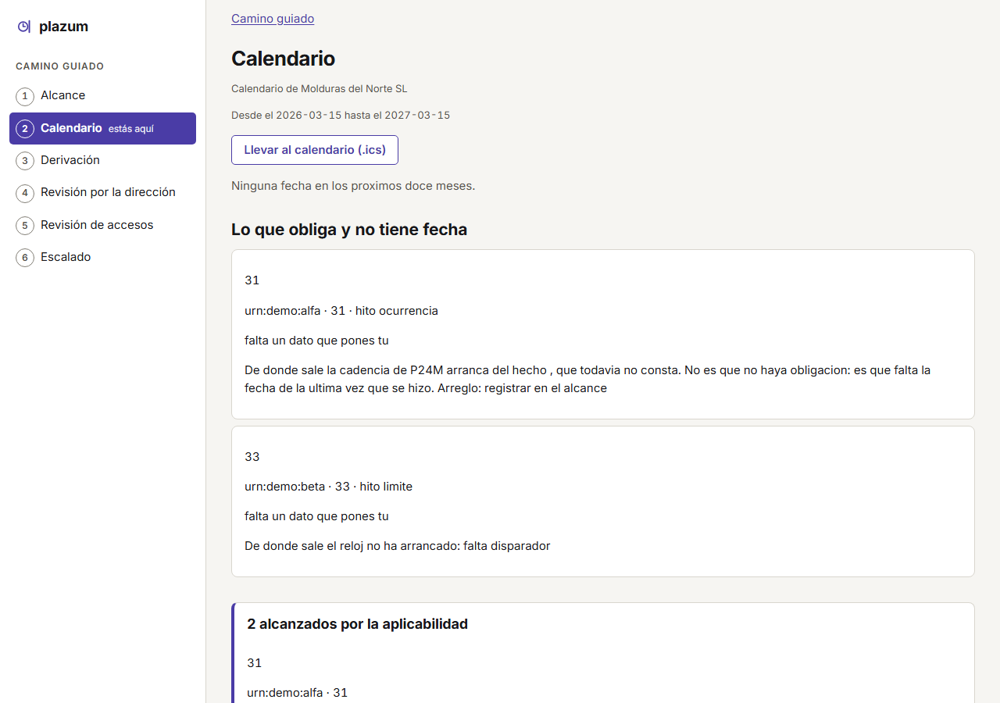
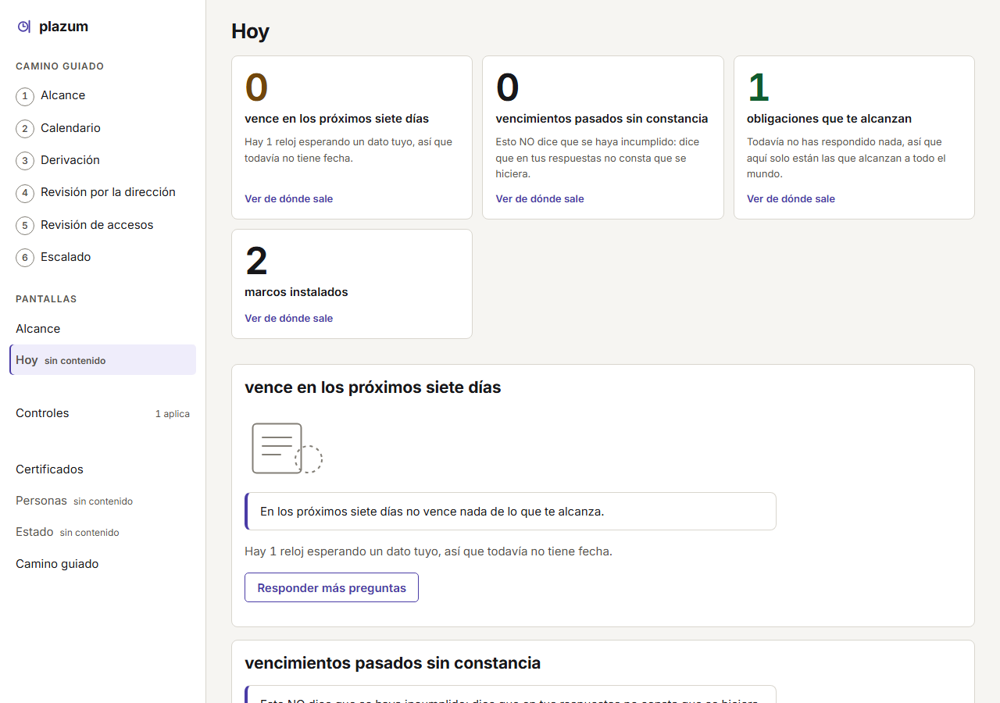
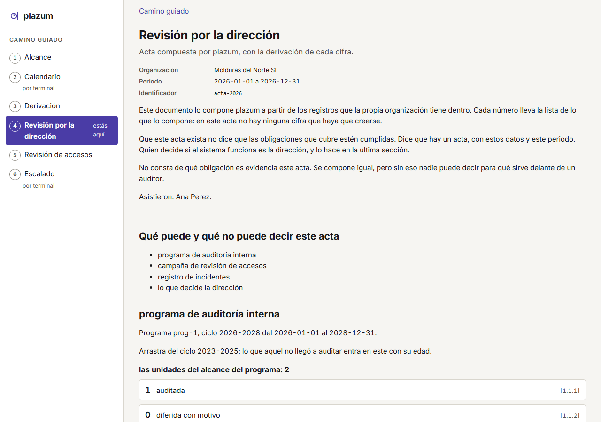

# plazum

[](https://github.com/marcosmatalab/plazum/actions/workflows/ci.yml)
[](#las-cinco-cifras-y-su-comando)
[](LICENSE)
[](https://github.com/marcosmatalab/plazum/releases/latest)
[](go.mod)
[](README.en.md)

**El GRC de continuidad: no pierdas nunca la conformidad.**

Un solo binario en Go que sabe qué normas te aplican, qué tienes que hacer y para qué fecha exacta, con la cita legal de cada cosa. Comprueba lo comprobable, agenda lo humano, genera los documentos y lo deja todo en un expediente que un auditor verifica sin red y sin fiarse de ti.

Cero dependencias: `go.mod` no tiene ni una línea `require`.



## Pruébalo en 30 segundos

```bash
docker build -t plazum . && docker run --rm plazum   # sin Go
```

```bash
go install github.com/marcosmatalab/plazum/cmd/plazum@latest
plazum demo                 # una empresa de ejemplo y sus relojes
plazum demo --serve         # y el servidor con ese estado
plazum calendario --pais=ES --sector=servicios-digitales --empleados=200
```


O baja el binario de tu plataforma en [la última release](https://github.com/marcosmatalab/plazum/releases/latest): SHA256, SBOM y firma en Rekor.

Cada fila sale marcada `[supuesto]`: es lo que le pasaría a una empresa de ese perfil, no a la tuya.

## Las cinco cifras y su comando

Ninguna se escribe a mano: las deriva un test del árbol y CI se pone rojo si se separan.

| Se afirma | Comando | Sale |
|---|---|---|
| Cero dependencias | `go list -deps -f '{{if not .Standard}}{{.ImportPath}}{{end}}' ./cmd/plazum \| grep -v '^github.com/marcosmatalab/plazum/'` | nada |
| 12,1 MB de 25 de presupuesto ([por qué](docs/presupuesto-binario.md)) | `GOOS=linux GOARCH=amd64 go build -ldflags="-s -w" -trimpath -o plazum ./cmd/plazum` | 12,1 MB en `linux/amd64` |
| La suite pasa sin red | `GOPROXY=off go test ./...` | `ok` |
| El núcleo no baja del 85 % | `go test ./nucleo/... -coverprofile=c.out && go tool cover -func=c.out` | sobre el suelo |
| Las puertas de CI, en tu máquina | `./comprobar.sh` | `26 puertas leidas` |

<!-- ingenieria:inicio -->
Lo medido, no lo prometido: **2.027 casos de test** con fuzzing y detector de carreras, **75.000 líneas de producción** y **109.000 de test**, suelo duro de **85 %** de cobertura del núcleo, y **24 de las 26 puertas de CI en cada empujón y en cada pull request**, repartidas en 9 de los **13 workflows**. Las otras dos: un cron diario y la etiqueta de release.

*Las deriva `TestElParrafoDeIngenieriaPublicaLoQueDiceElArbol`, y el suelo sale de `ci.yml`. Hasta que tuvo puerta, cuatro de sus cinco cifras estaban viejas.*
<!-- ingenieria:fin -->

## Los tres pilares

1. **Reloj legal de verdad.** Días hábiles, calendarios estatal, autonómico y local combinables, cierre y traslado según el Rgto. 1182/71 y la Ley 39/2015, suspensiones y prórrogas. Cuando la doctrina discrepa se calculan las dos lecturas y se enseña la divergencia con su cita.
2. **Expediente verificable offline.** Cadena de hashes, Merkle RFC 6962, sellado RFC 3161: un tercero lo recalcula entero sin red y sin fiarse del emisor. Lo que prueba y lo que **no**, en [`docs/modelo-de-amenaza.md`](docs/modelo-de-amenaza.md), con el ataque que puso cada capa.
3. **El corpus es datos, no código.** Añadir la norma 21 no toca una línea de código, y el build se rompe si alguien cablea un identificador de norma.

| Lo que vence hoy | El acta: de dónde sale cada fecha |
|---|---|
|  |  |

## El corpus

**20 paquetes** con su estrato legal ([`paquetes/CORPUS.md`](paquetes/CORPUS.md)), los **20 con relojes reales: 285 hitos y 808 casos dorados** contra el motor en cada `./comprobar.sh`. Cuánto de la v1 está escrito, computado por un test, en [`docs/cobertura-v1.md`](docs/cobertura-v1.md): corregido tres veces, y las tres hacia abajo.

## Dónde se acota el modelo, y con qué se comprueba

plazum emite fechas con consecuencias jurídicas, así que el motor es determinista por contrato y el modelo no entra en él. La frontera es ejecutable:

| Garantía | Mecanismo | Se comprueba con |
|---|---|---|
| El motor no depende de un modelo | `nucleo/` no importa nada de fuera | test sobre el AST |
| El cálculo es reproducible | el instante entra como dato, no del reloj | test sobre el AST |
| Funciona con el modelo apagado | interruptor `PLAZUM_SIN_IA` | la suite entera, apagada, en CI |
| Ninguna cita llega sin verificar | se resuelve por hash contra el texto de la norma | si no resuelve, se descarta |
| No puede inventar una norma que no tiene | el linter de frontera legal no deja que un paquete referencial lleve el texto de la cláusula | los 20 paquetes se cargan con el linter en cada ejecución |

La precisión del verificador de citas se publica, no se promete: **28 casos dorados sobre 8 fuentes** en `evals/citas/`, con su corpus adversario y el motivo de cada descarte. Doctrina en [`docs/ia.md`](docs/ia.md).

## Decisiones y lo que cuestan

| Decisión | Compra | Cuesta |
|---|---|---|
| Cero dependencias | auditoría sin red, superficie de suministro nula | PKCS#7 y RFC 3161 vendorizados, con procedencia por SHA-256 |
| El instante es un dato | un expediente de hace ocho meses se reverifica igual hoy | el instante cruza toda la API del núcleo |
| Corpus como datos | añadir una norma no toca Go | un formato y un linter que mantener, y 808 dorados que correr |
| OSCAL solo de salida | no se dobla el modelo para encajar en uno sin plazos | no hay ida y vuelta, y se dice ([D-1](docs/decisiones.md)) |
| Un repositorio | el corpus viaja dentro del binario | dos licencias conviviendo, resueltas por directorio |

## Presupuestos operativos

Cada uno es una promesa con puerta. **Un presupuesto no se mueve porque la medida se vuelva honesta.**

| Presupuesto | Techo | Hoy | Puerta |
|---|---|---|---|
| Binario | 25 MB | 12,1 MB en `linux/amd64` | igualdad exacta contra el árbol |
| Cobertura del núcleo | 85 % | 88,3 % | bloqueante en CI |
| Arranque en frío | 3 s | cumple | `.github/presupuesto.sh`, en CI |
| Memoria residente | 256 MB | cumple | `.github/presupuesto.sh`, en CI |
| Fichero mayor | 1.300 líneas | 1.263 | derivada del árbol |

Las reglas, cada una con la fecha del día en que algo se rompió por no tenerla, en [`docs/invariantes.md`](docs/invariantes.md). El entorno de desarrollo, en [`docs/desarrollo.md`](docs/desarrollo.md).

## Estado, licencia y aviso legal

**Etapas 1 y 2 cerradas, la 3 (corpus) abierta.** El plan, en [`docs/ETAPAS.md`](docs/ETAPAS.md); lo que está a medias, sin disimular, en [`docs/pendientes.md`](docs/pendientes.md).

Código **AGPL-3.0**, SSO incluido. El corpus, **Apache-2.0**. De pago es la vigilancia del contenido, no el contenido: que alguien mire el BOE y el DOUE cada semana y te avise antes que tú. **No se vende garantía jurídica.** Soporte: Discussions, sin SLA. Vulnerabilidades: [`SECURITY.md`](SECURITY.md).

**Nada de esto es asesoramiento jurídico.**
