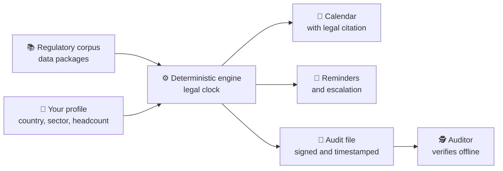

<div align="center">


[](https://github.com/marcosmatalab/plazum/actions/workflows/ci.yml)
[](https://github.com/marcosmatalab/plazum/releases/latest)
[](go.mod)
[](go.mod)
[](#-by-the-numbers)
[](LICENSE)
[](README.es.md)

**plazum tells you which regulations apply to you, what you have to do and by which exact date, with the legal citation behind every deadline. Then it keeps the proof that you did it in an audit file anyone can verify offline.**

[🚀 Try it](#-try-it-in-30-seconds) · [🔄 How it works](#-how-it-works) · [📊 Numbers](#-by-the-numbers) · [🏛️ Architecture](#️-architecture) · [📖 Docs](#-documentation)

</div>

## 🎯 In 45 seconds

| | |
|---|---|
| 🧭 **What** | An open-source **compliance continuity** platform (GRC): it turns EU and Spanish regulation (NIS2, DORA, GDPR, the AI Act, the CRA, eIDAS 2, ISO 27001...) into a calendar of obligations with exact due dates. |
| 👥 **Who for** | CISOs and DPOs who need to know what is due, when, and under which article. |
| ⚙️ **How** | A deterministic engine with a **legal clock** (working days, public holidays, closing and carry-over rules) running on a regulatory corpus written as **data**, not code. |
| 📦 **Delivers** | Calendar, escalating reminders, access reviews and a **signed audit file** a third party recomputes without trusting the issuer. |


## 🚀 Try it in 30 seconds

```bash
docker run --rm ghcr.io/marcosmatalab/plazum:v0.1.1   # no Go, no clone
```

```bash
go install github.com/marcosmatalab/plazum/cmd/plazum@latest
plazum demo                 # a sample company and its clocks
plazum demo --serve         # and the web server on that state
plazum calendario --pais=ES --sector=servicios-digitales --empleados=200
```


📥 Binaries for Linux, macOS and Windows in [the latest release](https://github.com/marcosmatalab/plazum/releases/latest), with **SHA-256, SBOM and a Rekor signature**. Full guide: [`docs/instalacion.md`](docs/instalacion.md).

## 🔄 How it works



### Three pillars

| ⏱️ A real legal clock | 🔐 An audit file verifiable offline | 📚 The corpus is data |
|---|---|---|
| Working days, combinable holiday calendars, closing and carry-over rules under Regulation 1182/71 and Spanish Law 39/2015. When doctrine disagrees, both readings are computed. | Hash chain, RFC 6962 Merkle tree and RFC 3161 timestamping: a third party recomputes it all without network access. | Adding a regulation touches no Go, and the build breaks if anyone hard-codes a regulation identifier. |

## 🖥️ Screens

| 📌 What is due today | 🧾 The record: where every date comes from |
|---|---|
|  |  |
| 🔔 **Escalating reminder plan** | 🔑 **Sealed access review** |
|  |  |

The product UI ships in Spanish and English; the screenshots show the Spanish locale.

## 📊 By the numbers

<!-- ingenieria:inicio -->
| 🧪 Test cases | 📦 Production lines | 🔬 Test lines | 🛡️ Core coverage floor | ⚙️ Continuous integration |
|:---:|:---:|:---:|:---:|:---:|
| **2,031** | **75,000** | **109,000** | **85 %** | **26 gates** in **13 workflows** |

With fuzzing and the race detector, and **24 of the 26 gates on every push and every pull request**. *Derived from the tree by `TestElParrafoDeIngenieriaPublicaLoQueDiceElArbol`: if the code and this table drift apart, CI turns red.*
<!-- ingenieria:fin -->

📚 **The corpus:** **20 packages** with their legal stratum ([`paquetes/CORPUS.md`](paquetes/CORPUS.md)), all **20 with real clocks: 285 milestones and 808 golden cases** run against the engine on every `./comprobar.sh`.

### ✅ Every claim, with its command

| Claim | Command | Output |
|---|---|---|
| Zero dependencies | `go list -deps -f '{{if not .Standard}}{{.ImportPath}}{{end}}' ./cmd/plazum \| grep -v '^github.com/marcosmatalab/plazum/'` | nothing |
| 12.1 MB binary against a 25 MB budget | `GOOS=linux GOARCH=amd64 go build -ldflags="-s -w" -trimpath -o plazum ./cmd/plazum` | 12.1 MB on `linux/amd64` |
| The suite passes with no network | `GOPROXY=off go test ./...` | `ok` |
| Core coverage never drops below 85 % | `go test ./nucleo/... -coverprofile=c.out && go tool cover -func=c.out` | above the floor |
| Every CI gate runs on your machine | `./comprobar.sh` | `26 puertas leidas` |

## 🧠 AI behind an executable boundary

The engine emits dates with legal consequences: it is deterministic by contract and no model runs inside it.

| Guarantee | Enforced by |
|---|---|
| 🧮 The engine depends on no model | AST test: `nucleo/` imports nothing external |
| 🔁 Every computation is reproducible | AST test: time is an input, never the system clock |
| 🔌 It works with the model switched off | the whole suite runs with `PLAZUM_SIN_IA` as a CI gate |
| 🔗 No citation is shown unverified | resolved by hash against the regulation text, or discarded |

Citation accuracy is published: **28 golden cases over 8 sources** in `evals/citas/`. Doctrine in [`docs/ia.md`](docs/ia.md).

## 🏛️ Architecture

Hexagonal, with its boundaries guarded by tests that read the AST:

| Layer | Contents |
|---|---|
| `nucleo/` | legal clock, applicability, state, ledger, audit file, corpus. **Zero external imports** |
| `puertos/` | the hexagonal interfaces |
| `adaptadores/` | OIDC, SCIM, RFC 3161 timestamping, notification channels, AI |
| `superficies/` | web server, screens, calendar, access review, SCIM, SIEM export |
| `paquetes/` | the regulatory corpus, as data |
| `cmd/plazum` | the CLI: `demo`, `calendario`, `verify`, `explain`, `estado` |

### 🧭 Design decisions

| Decision | What it buys |
|---|---|
| Zero dependencies | offline auditability and no supply-chain surface |
| Time is an input | an eight-month-old audit file reverifies identically today |
| Corpus as data | adding a regulation touches no Go |
| OSCAL as output only | the internal model keeps its deadlines ([D-1](docs/decisiones.md)) |

### 📏 Operating budgets, each gated in CI

| Budget | Ceiling |
|---|---|
| 📦 Binary | 25 MB |
| 🛡️ Core coverage | ≥ 85 % |
| ⚡ Cold start | < 3 s |
| 🧠 Resident memory | < 256 MB |

## 📖 Documentation

The domain is Spanish and EU law, whose identifiers do not survive translation, so the in-depth documentation is written in Spanish.

| | |
|---|---|
| 📐 [`docs/invariantes.md`](docs/invariantes.md) | the engineering rules and the test that guards each one |
| 🏗️ [`docs/arquitectura.md`](docs/arquitectura.md) | the architecture in depth |
| 🛡️ [`docs/modelo-de-amenaza.md`](docs/modelo-de-amenaza.md) | what the audit file proves |
| 🗺️ [`docs/ETAPAS.md`](docs/ETAPAS.md) | roadmap: stages 1 and 2 closed, stage 3 in progress |
| 🛠️ [`docs/desarrollo.md`](docs/desarrollo.md#como-se-construyo) | how it was built, and the gates every change passes |

📌 Open work and known limitations: [`docs/pendientes.md`](docs/pendientes.md).

## ⚖️ Licence

Code **AGPL-3.0**, SSO included. Corpus data **Apache-2.0**. Vulnerabilities: [`SECURITY.md`](SECURITY.md). **None of this is legal advice.**
